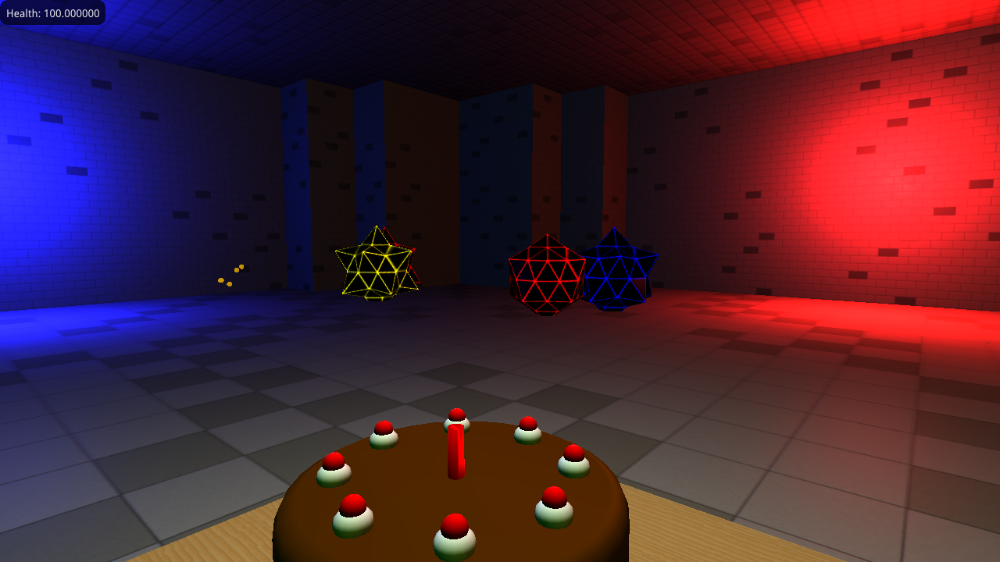

# CS 488 Final Project

Made by Michael Hitchens

A small arcade FPS called "Get Away From My Cake!". The story is as follows:

> It's your birthday and you baked a lovely cake. It smells so good that
> aliens from outer space have invited themselves over to steal it! You, armed
> with your super effective paint ball gun, must protect your cake at all
> costs! Retreating into your basement, you prepare for a final standoff...



## Compilation

This project uses CMake the normal way:

```
mkdir build
cd build
cmake ..
make -j8
```

## Running

Run this from the root:

    ./build/src/cs488project

Otherwise the game will complain about finding assets.

## Controls

Menus are navigated with the mouse. The gameplay consists of moving the mouse to
look around; holding the left mouse button to shoot; and using the W, A, S, and
D keys to navigate the space.

## Misc

I did not implement shadow mapping or BSP trees. I implemented everything else.

## Credits

The Lift Kevin MacLeod (incompetech.com)  
Licensed under Creative Commons: By Attribution 3.0 License  
http://creativecommons.org/licenses/by/3.0/

All sounds generated by http://www.bfxr.net/

All textures were made by Michael Hitchens in Gimp.

All models were made by Michael Hitchens in Blender.

The following libraries were used:

  * SDL2 -- A better GLFW (zlib license)
  * SDL2\_mixer -- SDL2 addon for playing sound (zlib license)
  * glm -- For 3D math (Modified MIT)
  * gl3w -- For OpenGL 3.3 functionality (public domain)
  * dear imgui -- For UI (MIT license)

## Objectives

 1. Modelled scene in the form of a playable level
 2. User interface for starting game and changing graphics options
 3. Sychronized sound with player actions
 4. Keyframe animation with linear interpolation
 5. Texture mapping of scene geometry using external textures
 6. Normal mapping of scene geometry using external textures
 7. Particle system for impact effects and intersting scene features
 8. Dynamic shadows using shadow mapping [NOT ATTEMPTED]
 9. Binary space partitioning tree generation [NOT ATTEMPTED]
10. Binary space partitioning tree traversal [NOT ATTEMPTED]
